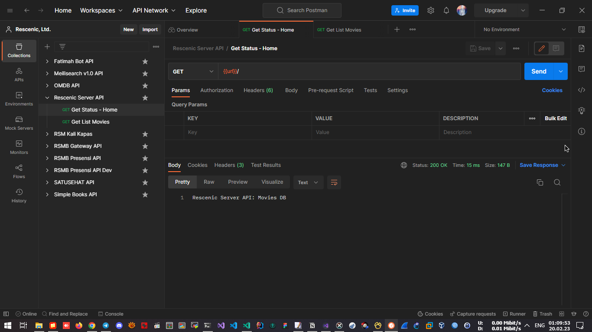
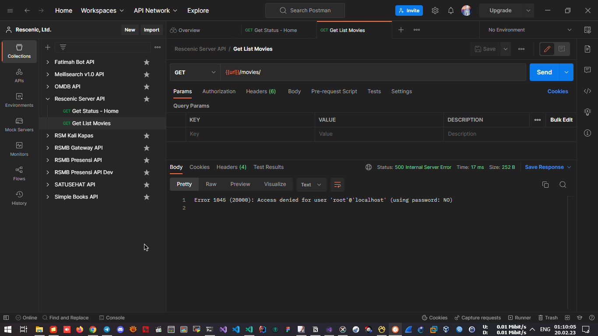
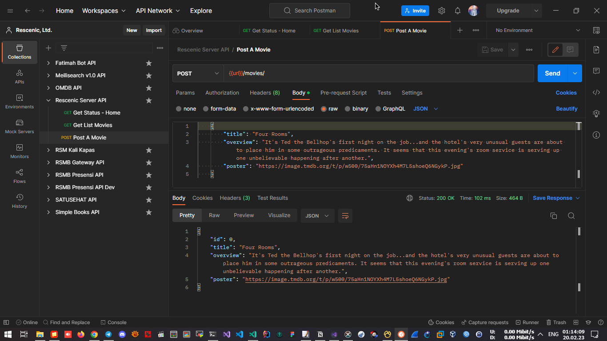
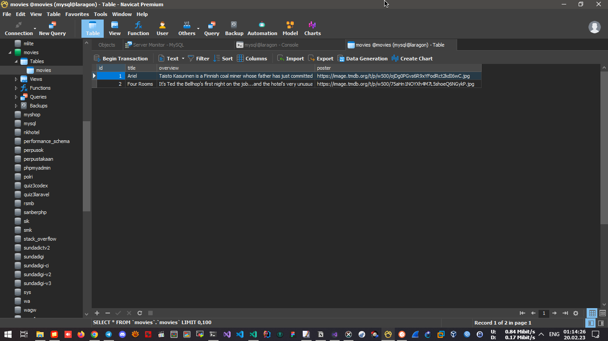
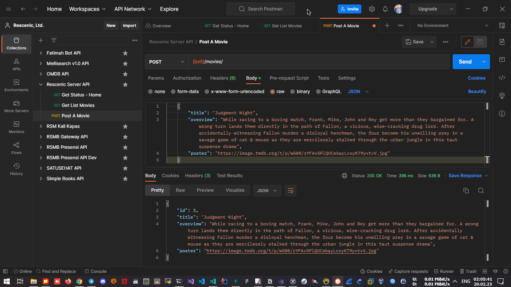
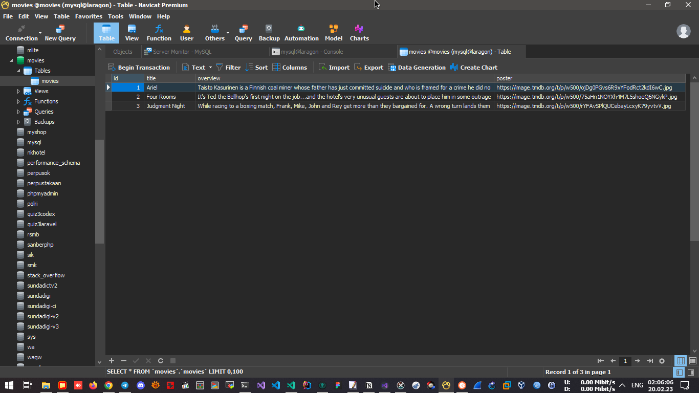
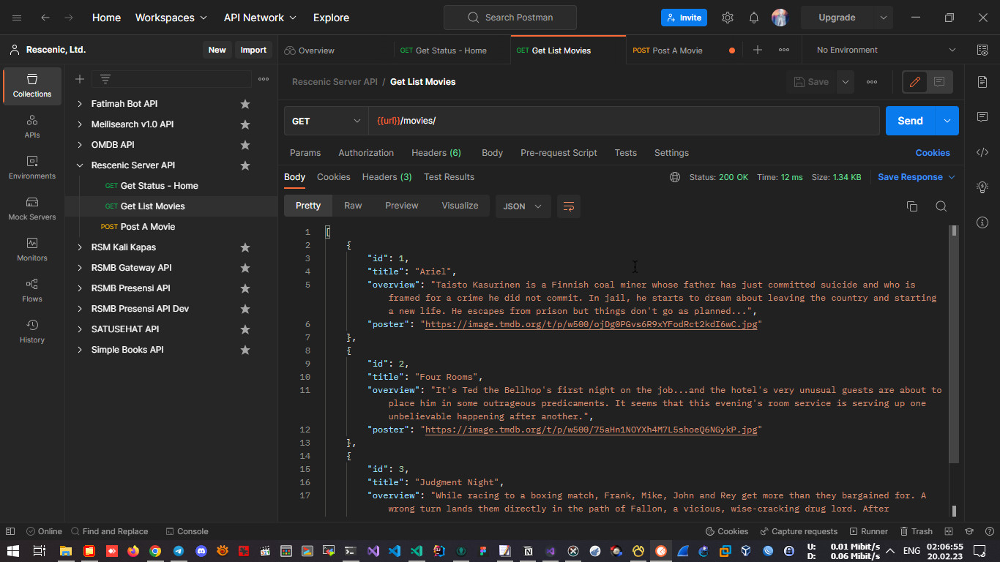

# Assignment Mini Class Golang Salt Academy

### [Muhammad Ridwan Hakim, S.T.](https://github.com/rescenic)<hr>

## Assignment Tasks
1. Buat API dengan http method GET & POST
2. Response API harus berupa data JSON
3. Implementasikan Method Receiver dan Interface

## Assets
- movies.json (src: [meilisearch](https://docs.meilisearch.com/learn/getting_started/quick_start.html#add-documents))<br>
- movies.py (Menghapus object "genre" dan "release_date")<br>
- moviesv2.json (Data Sampel)<br>
- movies.sql / movies-structure-only.sql <br>
> Pilih salah satu file .sql, import ke dalam db "movies" di MySQL/MariaDB Server).<br>

## Panduan
1. Masuk ke terminal (PowerShell/Git Bash)
1. git clone https://github.com/rescenic/sa_miniclass_mrh.git
2. cd sa_miniclass_mrh
3. go run main.go
4. Buka Postman, silakan menggunakan Katalog Web Service yang tersedia.

## Katalog Web Service
- http://localhost:8082 : Get Status - Home<br>
- http://localhost:8082/movies/ : Get List Movies<br>
- http://localhost:8082/movies/ : Post A Movie<br>
> Klik pada tab "Body", pilih "raw" dan pilih "JSON (application/json)" sebagai tipe konten.<br>
Pada request body, masukkan rincian film dalam format JSON.<br>
Contoh data sampel ada di assets/moviesv2.json.<br>
```
{
    "title": "The Godfather",
    "overview": "The aging patriarch of an organized crime dynasty transfers control of his clandestine empire to his reluctant son.",
    "poster": "https://www.themoviedb.org/t/p/w440_and_h660_face/rPdtLWNsZmAtoZl9PK7S2wE3qiS.jpg"
}

```

## Screenshots
- Home <br>


- Setting koneksi untuk login ke MySQL/MariaDB<br>


- POST Method v1: Tidak menampilkan respon id movies sesuai dengan yang di DB MySQL/MariaDB<br>



- POST Method v2: Menampilkan respon id movies sesuai dengan yang di DB MySQL/MariaDB<br>



- Get List Movies<br>


## GitHub Repo: [https://github.com/rescenic/sa_miniclass_mrh](https://github.com/rescenic/sa_miniclass_mrh)